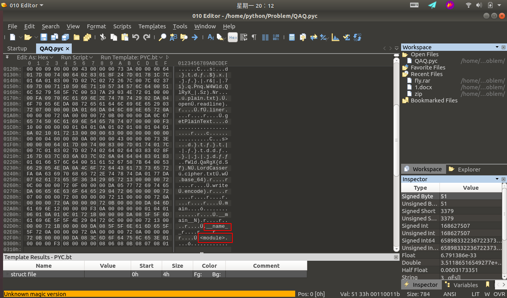
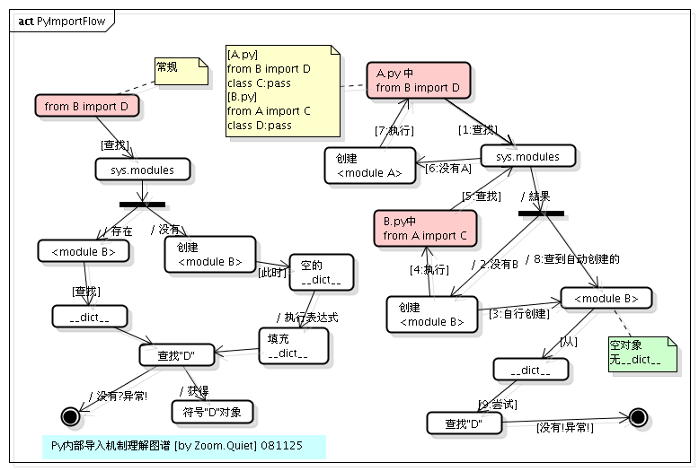
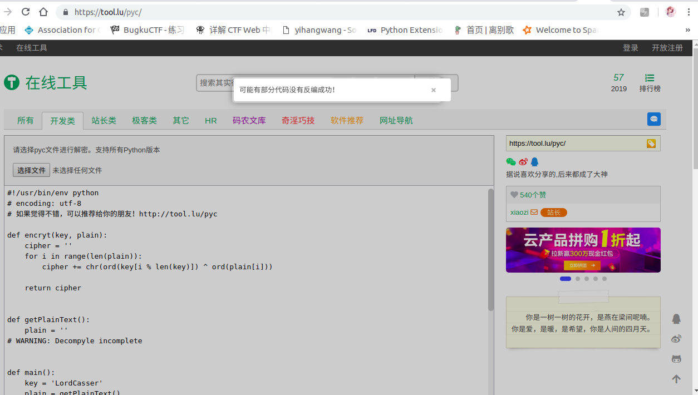
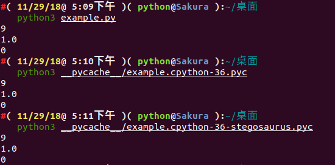
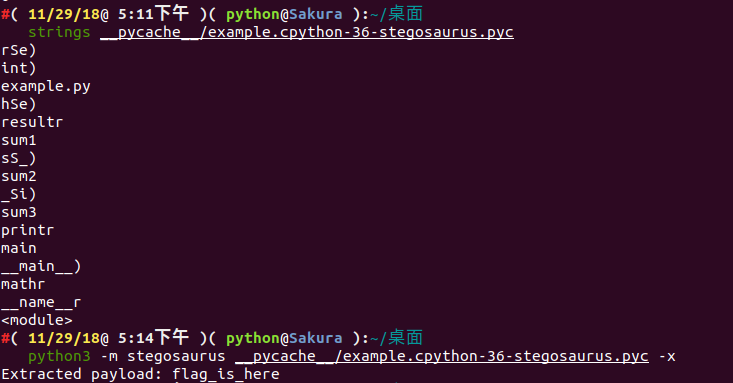

# pyc文件

code object
===

> 在我們導入 python 腳本時在目錄下會生成個一個相應的 pyc 文件，是pythoncodeobj的持久化儲存形式,加速下一次的裝載。


## 文件結構

pyc文件由三大部分組成

- 最開始4個字節是一個Maigc int, 標識此pyc的版本信息

- 接下來四個字節還是個int,是pyc產生的時間

- 序列化的 PyCodeObject,結構參照[include/code.h](https://github.com/python/cpython/blob/master/Include/code.h),序列化方法[python/marshal](https://github.com/python/cpython/blob/master/Python/marshal.c)

**pyc完整的文件解析可以參照**

- [Python程序的執行原理](http://python.jobbole.com/84599/)
- [PYC文件格式分析](http://kdr2.com/tech/python/pyc-format.html)


**關於co_code**

一串二進制流,代表着指令序列,具體定義在[include/opcode.h](https://github.com/python/cpython/blob/fc7df0e664198cb05cafd972f190a18ca422989c/Include/opcode.h)中,也可以參照[python opcodes](http://unpyc.sourceforge.net/Opcodes.html)。

由

- 指令(opcode),分爲有參數和無參數兩種,以 https://github.com/python/cpython/blob/fc7df0e664198cb05cafd972f190a18ca422989c/Include/opcode.h#L69 劃分

- 參數(oparg)

python3.6 以上參數永遠佔1字節,如果指令不帶參數的話則以`0x00`代替,在運行過程中被解釋器忽略,也是**Stegosaurus**技術原理;而低於python3.5的版本中指令不帶參數的話卻沒有`0x00`填充


### 例題

**[Hackover CTF 2016 : img-enc](https://github.com/ctfs/write-ups-2016/tree/master/hackover-ctf-2016/forensics/img-enc)**

首先嚐試pycdc反編譯失敗

```python
# Source Generated with Decompyle++
# File: imgenc.pyc (Python 2.7)

import sys
import numpy as np
from scipy.misc import imread, imsave

def doit(input_file, output_file, f):
Unsupported opcode: STOP_CODE
    img = imread(input_file, flatten = True)
    img /= 255
    size = img.shape[0]
# WARNING: Decompyle incomplete
```

注意到是python2.7,也就是說指令序列共佔1字節或3字節(有參數無參數)

使用pcads得到

```xml
imgenc.pyc (Python 2.7)
...
                67      STOP_CODE               
                68      STOP_CODE               
                69      BINARY_DIVIDE           
                70      JUMP_IF_TRUE_OR_POP     5
                73      LOAD_CONST              3: 0
                76      LOAD_CONST              3: 0
                79      BINARY_DIVIDE       
```

定位到出錯的地方,觀察發現 `LOAD_CONST LOAD_CONST BINARY_DIVIDE STORE_FAST opcodes (64 03 00 64 03 00 15 7d 05 00)`被破壞了,根據上下文線索修復後

```xml
00000120  64 04 00 6b 00 00 72 ce  00 64 03 00 64 03 00 15  |d..k..r..d..d...|
00000130  7d 05 00 64 03 00 64 03  00 15 7d 05 00 64 03 00  |}..d..d...}..d..|
00000140  64 03 00 15 7d 05 00 64  03 00 64 03 00 15 7d 05  |d...}..d..d...}.|
00000150  00 64 03 00 64 03 00 15  7d 05 00 64 03 00 64 03  |.d..d...}..d..d.|
00000160  00 15 7d 05 00 64 03 00  64 03 00 15 7d 05 00 64  |..}..d..d...}..d|
00000170  03 00 64 03 00 15 7d 05  00 64 03 00 64 03 00 15  |..d...}..d..d...|
00000180  7d 05 00 64 03 00 64 03  00 15 7d 05 00 64 03 00  |}..d..d...}..d..|
00000190  64 03 00 15 7d 05 00 64  03 00 64 03 00 15 7d 05  |d...}..d..d...}.|
000001a0  00 64 03 00 64 03 00 15  7d 05 00 64 03 00 64 03  |.d..d...}..d..d.|
000001b0  00 15 7d 05 00 64 03 00  64 03 00 15 7d 05 00 6e  |..}..d..d...}..n|
```

接下來根據修復好的python源代碼得到flag即可


**延伸**:

- 題目: [0ctf-2017:py](https://github.com/ctfs/write-ups-2017/tree/master/0ctf-quals-2017/reverse/py-137)
- writeup: [記一次手擼CPython bytecode](http://0x48.pw/2017/03/20/0x2f/)


## Tools


### [pycdc](https://github.com/zrax/pycdc)

> 將python字節碼轉換爲可讀的python 源代碼,包含了反彙編(pycads)和反編譯(pycdc)兩種工具

### [Stegosaurus](https://github.com/AngelKitty/stegosaurus)

> Stegosaurus 是一款隱寫工具，它允許我們在 Python 字節碼文件( pyc 或 pyo )中嵌入任意 Payload。由於編碼密度較低，因此我們嵌入 Payload 的過程既不會改變源代碼的運行行爲，也不會改變源文件的文件大小。 Payload 代碼會被分散嵌入到字節碼之中，所以類似 strings 這樣的代碼工具無法查找到實際的 Payload。 Python 的 dis 模塊會返回源文件的字節碼，然後我們就可以使用 Stegosaurus 來嵌入 Payload 了。

原理是在 python 的字節碼文件中，利用冗餘空間，將完整的 payload 代碼分散隱藏到這些零零碎碎的空間中。

具體用法可參看 [ctf-tools](https://ctf-wiki.github.io/ctf-tools/misc/)。

#### 例題

Bugku QAQ

賽題鏈接如下：

```shell
http://ctf.bugku.com/files/447e4b626f2d2481809b8690613c1613/QAQ
http://ctf.bugku.com/files/5c02892cd05a9dcd1c5a34ef22dd9c5e/cipher.txt
```

首先拿到這道題，用 `010Editor` 乍一眼看過去，我們可以看到一些特徵信息：



可以判斷這是個跟 `python` 有關的東西，通過查閱相關資料可以判斷這是個 `python` 經編譯過後的 `pyc` 文件。這裏可能很多小夥伴們可能不理解了，什麼是 `pyc` 文件呢？爲什麼會生成 `pyc` 文件？ `pyc` 文件又是何時生成的呢？下面我將一一解答這些問題。

簡單來說， `pyc` 文件就是 `Python` 的字節碼文件，是個二進制文件。我們都知道 `Python` 是一種全平臺的解釋性語言，全平臺其實就是 `Python` 文件在經過解釋器解釋之後(或者稱爲編譯)生成的 `pyc` 文件可以在多個平臺下運行，這樣同樣也可以隱藏源代碼。其實， `Python` 是完全面向對象的語言， `Python` 文件在經過解釋器解釋後生成字節碼對象 `PyCodeObject` ， `pyc` 文件可以理解爲是 `PyCodeObject` 對象的持久化保存方式。而 `pyc` 文件只有在文件被當成模塊導入時纔會生成。也就是說， `Python` 解釋器認爲，只有 `import` 進行的模塊才需要被重用。 生成 `pyc` 文件的好處顯而易見，當我們多次運行程序時，不需要重新對該模塊進行重新的解釋。主文件一般只需要加載一次，不會被其他模塊導入，所以一般主文件不會生成 `pyc` 文件。

我們舉個例子來說明這個問題：

爲了方便起見，我們事先創建一個test文件夾作爲此次實驗的測試：

```shell
mkdir test && cd test/
```

假設我們現在有個 `test.py` 文件，文件內容如下：

```python
def print_test():
    print('Hello,Kitty!')

print_test()
```

我們執行以下命令：

```shell
python3 test.py
```

不用說，想必大家都知道打印出的結果是下面這個：

```shell
Hello,Kitty!
```

我們通過下面命令查看下當前文件夾下有哪些文件：

```shell
ls -alh
```


我們可以發現，並沒有 `pyc` 文件生成。

‘我們再去創建一個文件爲 `import_test.py` 文件，文件內容如下：

> 注： `test.py` 和 `import_test.py` 應當放在同一文件夾下

```python
import test

test.print_test()
```

我們執行以下命令：

```shell
python3 import_test.py
```

結果如下：

```shell
Hello,Kitty!
Hello,Kitty!
```

誒，爲啥會打印出兩句相同的話呢？我們再往下看，我們通過下面命令查看下當前文件夾下有哪些文件：

```shell
ls -alh
```

結果如下：

```shell
總用量 20K
drwxr-xr-x 3 python python 4.0K 11月  5 20:38 .
drwxrwxr-x 4 python python 4.0K 11月  5 20:25 ..
-rw-r--r-- 1 python python   31 11月  5 20:38 import_test.py
drwxr-xr-x 2 python python 4.0K 11月  5 20:38 __pycache__
-rw-r--r-- 1 python python   58 11月  5 20:28 test.py
```

誒，多了個 `__pycache__` 文件夾，我們進入文件夾下看看有什麼？

```shell
cd __pycache__ && ls
```


我們可以看到生成了一個 `test.cpython-36.pyc` 。爲什麼是這樣子呢？

我們可以看到，我們在執行 `python3 import_test.py` 命令的時候，首先開始執行的是 `import test` ，即導入 `test` 模塊，而一個模塊被導入時， `PVM(Python Virtual Machine)` 會在後臺從一系列路徑中搜索該模塊，其搜索過程如下：

- 在當前目錄下搜索該模塊
- 在環境變量 `PYTHONPATH` 中指定的路徑列表中依次搜索
- 在 `python` 安裝路徑中搜索

事實上， `PVM` 通過變量 `sys.path` 中包含的路徑來搜索，這個變量裏面包含的路徑列表就是上面提到的這些路徑信息。

模塊的搜索路徑都放在了 `sys.path` 列表中，如果缺省的 `sys.path` 中沒有含有自己的模塊或包的路徑，可以動態的加入 `(sys.path.apend)` 即可。

事實上， `Python` 中所有加載到內存的模塊都放在 `sys.modules` 。當 `import` 一個模塊時首先會在這個列表中查找是否已經加載了此模塊，如果加載了則只是將模塊的名字加入到正在調用 `import` 的模塊的 `Local` 名字空間中。如果沒有加載則從 `sys.path` 目錄中按照模塊名稱查找模塊文件，模塊文件可以是 `py` 、 `pyc` 、 `pyd` ，找到後將模塊載入內存，並加入到 `sys.modules` 中，並將名稱導入到當前的 `Local` 名字空間。

可以看出來，**一個模塊不會重複載入**。多個不同的模塊都可以用 `import` 引入同一個模塊到自己的 `Local` 名字空間，其實背後的 `PyModuleObject` 對象只有一個。

在這裏，我還要說明一個問題，**`import` 只能導入模塊，不能導入模塊中的對象(類、函數、變量等)。**例如像上面這個例子，我在 `test.py` 裏面定義了一個函數 `print_test()` ，我在另外一個模塊文件 `import_test.py`不能直接通過 `import test.print_test` 將 `print_test` 導入到本模塊文件中，只能用 `import test` 進行導入。如果我想只導入特定的類、函數、變量，用 `from test import print_test` 即可。 


既然說到了 `import` 導入機制，再提一提嵌套導入和 `Package` 導入。

**`import` 嵌套導入**

嵌套，不難理解，就是一個套着一個。小時候我們都玩過俄羅斯套娃吧，俄羅斯套娃就是一個大娃娃裏面套着一個小娃娃，小娃娃裏面還有更小的娃娃，而這個嵌套導入也是同一個意思。假如我們現在有一個模塊，我們想要導入模塊 `A` ，而模塊 `A` 中有含有其他模塊需要導入，比如模塊 `B` ，模塊 `B` 中又含有模塊 `C` ，一直這樣延續下去，這種方式我們稱之爲 `import` 嵌套導入。

對這種嵌套比較容易理解，我們需要注意的一點就是各個模塊的 `Local` 名字空間是獨立的，所以上面的例子，本模塊 `import A` 完了後，本模塊只能訪問模塊 `A` ，不能訪問 `B` 及其它模塊。雖然模塊 `B` 已經加載到內存了，如果要訪問，還必須明確在本模塊中導入 `import B` 。

那如果我們有以下嵌套這種情況，我們該怎麼處理呢？

比如我們現在有個模塊 `A` ：

```python
# A.py
from B import D
class C:
    pass
```

還有個模塊 `B` ：

```python
# B.py
from A import C
class D:
    pass
```

我們簡單分析一下程序，如果程序運行，應該會去從模塊B中調用對象D。

我們嘗試執行一下 `python A.py` ：


報 `ImportError` 的錯誤，似乎是沒有加載到對象 `D` ，而我們將 `from B import D` 改成 `import B` ，我們似乎就能執行成功了。


這是怎麼回事呢？這其實是跟 `Python` 內部 `import` 的機制是有關的，具體到 `from B import D` ， `Python` 內部會分成以下幾個步驟：

- 在 `sys.modules` 中查找符號 `B`
- 如果符號 `B` 存在，則獲得符號 `B` 對應的 `module` 對象 `<module B>` 。從 `<module B>` 的 `__dict__` 中獲得符號 `D` 對應的對象，如果 `D` 不存在，則拋出異常
- 如果符號 `B` 不存在，則創建一個新的 `module` 對象 `<module B>` ，注意，此時 `module` 對象的 `__dict__` 爲空。執行 `B.py` 中的表達式，填充 `<module B>` 的 `__dict__`  。從 `<module B>` 的 `__dict__` 中獲得 `D` 對應的對象。如果 `D` 不存在，則拋出異常。

所以，這個例子的執行順序如下：

1、執行 `A.py` 中的 `from B import D` 

> 注：由於是執行的 `python A.py` ，所以在 `sys.modules` 中並沒有 `<module B>` 存在，首先爲 `B.py` 創建一個 `module` 對象( `<module B>` )，注意，這時創建的這個 `module` 對象是空的，裏邊啥也沒有，在 `Python` 內部創建了這個 `module` 對象之後，就會解析執行 `B.py` ，其目的是填充 `<module B>` 這個 `dict` 。

2、執行 `B.py` 中的 `from A import C` 

> 注：在執行 `B.py` 的過程中，會碰到這一句，首先檢查 `sys.modules` 這個 `module` 緩存中是否已經存在 `<module A>` 了，由於這時緩存還沒有緩存 `<module A>` ，所以類似的， `Python` 內部會爲 `A.py` 創建一個 `module` 對象( `<module A>` )，然後，同樣地，執行 `A.py` 中的語句。

3、再次執行 `A.py` 中的 `from B import D` 

> 注：這時，由於在第 `1` 步時，創建的 `<module B>` 對象已經緩存在了 `sys.modules` 中，所以直接就得到了 `<module B>` ，但是，注意，從整個過程來看，我們知道，這時 `<module B>` 還是一個空的對象，裏面啥也沒有，所以從這個 `module` 中獲得符號 `D` 的操作就會拋出異常。如果這裏只是 `import B` ，由於 `B` 這個符號在 `sys.modules` 中已經存在，所以是不會拋出異常的。

我們可以從下圖很清楚的看到 `import` 嵌套導入的過程：



**`Package` 導入**

包 `(Package)` 可以看成模塊的集合，只要一個文件夾下面有個 `__init__.py` 文件，那麼這個文件夾就可以看做是一個包。包下面的文件夾還可以成爲包(子包)。更進一步的講，多個較小的包可以聚合成一個較大的包。通過包這種結構，我們可以很方便的進行類的管理和維護，也方便了用戶的使用。比如 `SQLAlchemy` 等都是以包的形式發佈給用戶的。

包和模塊其實是很類似的東西，如果查看包的類型： `import SQLAlchemy type(SQLAlchemy)` ，可以看到其實也是 `<type 'module'>` 。 `import` 包的時候查找的路徑也是 `sys.path`。

包導入的過程和模塊的基本一致，只是導入包的時候會執行此包目錄下的 **`__init__.py`** ，而不是模塊裏面的語句了。另外，如果只是單純的導入包，而包的 `__init__.py` 中又沒有明確的其他初始化操作，那麼此包下面的模塊是不會自動導入的。

假設我們有如下文件結構：

```markdown
.
└── PA
    ├── __init__.py
    ├── PB1
    │   ├── __init__.py
    │   └── pb1_m.py
    ├── PB2
    │   ├── __init__.py
    │   └── pb2_m.py
    └── wave.py
```


`wave.py` ， `pb1_m.py` ， `pb2_m.py` 文件中我們均定義瞭如下函數：

```python
def getName():
	pass
```

`__init__.py` 文件內容均爲空。

我們新建一個 `test.py` ，內容如下：

```python
import sys
import PA.wave #1
import PA.PB1 #2
import PA.PB1.pb1_m as m1 #3
import PA.PB2.pb2_m #4
PA.wave.getName() #5
m1.getName() #6
PA.PB2.pb2_m.getName() #7
```

我們運行以後，可以看出是成功執行成功了，我們再看看目錄結構：

```markdown
.
├── PA
│   ├── __init__.py
│   ├── __init__.pyc
│   ├── PB1
│   │   ├── __init__.py
│   │   ├── __init__.pyc
│   │   ├── pb1_m.py
│   │   └── pb1_m.pyc
│   ├── PB2
│   │   ├── __init__.py
│   │   ├── __init__.pyc
│   │   ├── pb2_m.py
│   │   └── pb2_m.pyc
│   ├── wave.py
│   └── wave.pyc
└── test.py
```


我們來分析一下這個過程：

- 當執行`#1` 後， `sys.modules` 會同時存在 `PA` 、 `PA.wave` 兩個模塊，此時可以調用 `PA.wave` 的任何類或函數了。但不能調用 `PA.PB1(2)` 下的任何模塊。當前 `Local` 中有了 `PA` 名字。
- 當執行 `#2` 後，只是將 `PA.PB1` 載入內存， `sys.modules` 中會有 `PA` 、 `PA.wave` 、 `PA.PB1` 三個模塊，但是 `PA.PB1` 下的任何模塊都沒有自動載入內存，此時如果直接執行 `PA.PB1.pb1_m.getName()` 則會出錯，因爲 `PA.PB1` 中並沒有 `pb1_m` 。當前 `Local` 中還是隻有 `PA` 名字，並沒有 `PA.PB1` 名字。
- 當執行 `#3` 後，會將 `PA.PB1` 下的 `pb1_m` 載入內存， `sys.modules` 中會有 `PA` 、 `PA.wave` 、 `PA.PB1` 、 `PA.PB1.pb1_m` 四個模塊，此時可以執行 `PA.PB1.pb1_m.getName()` 了。由於使用了 `as` ，當前 `Local` 中除了 `PA` 名字，另外添加了 `m1` 作爲 `PA.PB1.pb1_m` 的別名。
- 當執行 `#4` 後，會將 `PA.PB2` 、 `PA.PB2.pb2_m` 載入內存， `sys.modules` 中會有 `PA` 、 `PA.wave` 、 `PA.PB1` 、 `PA.PB1.pb1_m` 、 `PA.PB2` 、 `PA.PB2.pb2_m` 六個模塊。當前 `Local` 中還是隻有 `PA` 、 `m1` 。
- 下面的 `#5` ，`#6` ， `#7` 都是可以正確運行的。

> 注：需要注意的問題是如果 `PA.PB2.pb2_m` 想導入 `PA.PB1.pb1_m` 、 `PA.wave` 是可以直接成功的。最好是採用明確的導入路徑，對於 `../..` 相對導入路徑還是不推薦使用。

既然我們已經知道 `pyc` 文件的產生，再回到那道賽題，我們嘗試將 `pyc` 文件反編譯回 `python` 源碼。我們使用在線的開源工具進行嘗試：



部分代碼沒有反編譯成功？？？我們可以嘗試分析一下，大概意思就是讀取 `cipher.txt` 那個文件，將那個文件內容是通過 `base64` 編碼的，我們的目的是將文件內容解碼，然後又已知 `key` ，通過 `encryt` 函數進行加密的，我們可以嘗試將代碼補全：

```python
def encryt(key, plain):
    cipher = ''
    for i in range(len(plain)):
        cipher += chr(ord(key[i % len(key)]) ^ ord(plain[i]))

    return cipher


def getPlainText():
    plain = ''
    with open('cipher.txt') as (f):
        while True:
            line = f.readline()
            if line:
                plain += line
            else:
                break

    return plain.decode('base_64')


def main():
    key = 'LordCasser'
    plain = getPlainText()
    cipher = encryt(key, plain)
    with open('xxx.txt', 'w') as (f):
        f.write(cipher)


if __name__ == '__main__':
    main()
```

結果如下：

```markdown
YOU ARE FOOLED
THIS IS NOT THAT YOU WANT
GO ON DUDE
CATCH THAT STEGOSAURUS
```

提示告訴我們用 `STEGOSAURUS` 工具進行隱寫的，我們直接將隱藏的payload分離出來即可。

```shell
python3 stegosaurus.py -x QAQ.pyc
```


我們得到了最終的 `flag` 爲：**`flag{fin4lly_z3r0_d34d}`**

既然都說到這個份子上了，我們就來分析一下我們是如何通過 `Stegosaurus` 來嵌入 `Payload` 。

我們仍然以上面這個代碼爲例子，我們設置腳本名稱爲 `encode.py` 。

第一步，我們使用 `Stegosaurus` 來查看在不改變源文件 `(Carrier)` 大小的情況下，我們的 `Payload` 能攜帶多少字節的數據：

```
python3 -m stegosaurus encode.py -r
```


現在，我們可以安全地嵌入最多24個字節的 `Payload` 了。如果不想覆蓋源文件的話，我們可以使用 `-s` 參數來單獨生成一個嵌入了 `Payload` 的 `py` 文件：

```shell
python3 -m stegosaurus encode.py -s --payload "flag{fin4lly_z3r0_d34d}"
```


現在我們可以用 `ls` 命令查看磁盤目錄，嵌入了 `Payload` 的文件( `carrier` 文件)和原始的字節碼文件兩者大小是完全相同的：


> 注：如果沒有使用 `-s` 參數，那麼原始的字節碼文件將會被覆蓋。

我們可以通過向 `Stegosaurus` 傳遞 `-x` 參數來提取出 `Payload` ：

```shell
python3 -m stegosaurus __pycache__/encode.cpython-36-stegosaurus.pyc -x
```


我們構造的 `Payload` 不一定要是一個 `ASCII` 字符串， `shellcode` 也是可以的：


我們重新編寫一個 `example.py` 模塊，代碼如下：

```python
import sys
import os
import math
def add(a,b):
    return int(a)+int(b)
def sum1(result):
    return int(result)*3

def sum2(result):
    return int(result)/3

def sum3(result):
    return int(result)-3

def main():
    a = 1
    b = 2
    result = add(a,b)
    print(sum1(result))
    print(sum2(result))
    print(sum3(result))

if __name__ == "__main__":
    main()
```

我們讓它攜帶 `Payload` 爲 `flag_is_here`。

 

我們可以查看嵌入 `Payload` 之前和之後的 `Python` 代碼運行情況：



通過 `strings` 查看 `Stegosaurus` 嵌入了 `Payload` 之後的文件輸出情況( `payload` 並沒有顯示出來)：



接下來使用 `Python` 的 `dis` 模塊來查看 `Stegosaurus` 嵌入 `Payload` 之前和之後的文件字節碼變化情況：

嵌入payload之前：

```shell
#( 11/29/18@ 5:14下午 )( python@Sakura ):~/桌面
   python3 -m dis example.py 
  1           0 LOAD_CONST               0 (0)
              2 LOAD_CONST               1 (None)
              4 IMPORT_NAME              0 (sys)
              6 STORE_NAME               0 (sys)

  2           8 LOAD_CONST               0 (0)
             10 LOAD_CONST               1 (None)
             12 IMPORT_NAME              1 (os)
             14 STORE_NAME               1 (os)

  3          16 LOAD_CONST               0 (0)
             18 LOAD_CONST               1 (None)
             20 IMPORT_NAME              2 (math)
             22 STORE_NAME               2 (math)

  4          24 LOAD_CONST               2 (<code object add at 0x7f90479778a0, file "example.py", line 4>)
             26 LOAD_CONST               3 ('add')
             28 MAKE_FUNCTION            0
             30 STORE_NAME               3 (add)

  6          32 LOAD_CONST               4 (<code object sum1 at 0x7f9047977810, file "example.py", line 6>)
             34 LOAD_CONST               5 ('sum1')
             36 MAKE_FUNCTION            0
             38 STORE_NAME               4 (sum1)

  9          40 LOAD_CONST               6 (<code object sum2 at 0x7f9047977ae0, file "example.py", line 9>)
             42 LOAD_CONST               7 ('sum2')
             44 MAKE_FUNCTION            0
             46 STORE_NAME               5 (sum2)

 12          48 LOAD_CONST               8 (<code object sum3 at 0x7f9047977f60, file "example.py", line 12>)
             50 LOAD_CONST               9 ('sum3')
             52 MAKE_FUNCTION            0
             54 STORE_NAME               6 (sum3)

 15          56 LOAD_CONST              10 (<code object main at 0x7f904798c300, file "example.py", line 15>)
             58 LOAD_CONST              11 ('main')
             60 MAKE_FUNCTION            0
             62 STORE_NAME               7 (main)

 23          64 LOAD_NAME                8 (__name__)
             66 LOAD_CONST              12 ('__main__')
             68 COMPARE_OP               2 (==)
             70 POP_JUMP_IF_FALSE       78

 24          72 LOAD_NAME                7 (main)
             74 CALL_FUNCTION            0
             76 POP_TOP
        >>   78 LOAD_CONST               1 (None)
             80 RETURN_VALUE
```

嵌入 `payload` 之後：

```shell
#( 11/29/18@ 5:31下午 )( python@Sakura ):~/桌面
   python3 -m dis example.py                                 
  1           0 LOAD_CONST               0 (0)
              2 LOAD_CONST               1 (None)
              4 IMPORT_NAME              0 (sys)
              6 STORE_NAME               0 (sys)

  2           8 LOAD_CONST               0 (0)
             10 LOAD_CONST               1 (None)
             12 IMPORT_NAME              1 (os)
             14 STORE_NAME               1 (os)

  3          16 LOAD_CONST               0 (0)
             18 LOAD_CONST               1 (None)
             20 IMPORT_NAME              2 (math)
             22 STORE_NAME               2 (math)

  4          24 LOAD_CONST               2 (<code object add at 0x7f146e7038a0, file "example.py", line 4>)
             26 LOAD_CONST               3 ('add')
             28 MAKE_FUNCTION            0
             30 STORE_NAME               3 (add)

  6          32 LOAD_CONST               4 (<code object sum1 at 0x7f146e703810, file "example.py", line 6>)
             34 LOAD_CONST               5 ('sum1')
             36 MAKE_FUNCTION            0
             38 STORE_NAME               4 (sum1)

  9          40 LOAD_CONST               6 (<code object sum2 at 0x7f146e703ae0, file "example.py", line 9>)
             42 LOAD_CONST               7 ('sum2')
             44 MAKE_FUNCTION            0
             46 STORE_NAME               5 (sum2)

 12          48 LOAD_CONST               8 (<code object sum3 at 0x7f146e703f60, file "example.py", line 12>)
             50 LOAD_CONST               9 ('sum3')
             52 MAKE_FUNCTION            0
             54 STORE_NAME               6 (sum3)

 15          56 LOAD_CONST              10 (<code object main at 0x7f146e718300, file "example.py", line 15>)
             58 LOAD_CONST              11 ('main')
             60 MAKE_FUNCTION            0
             62 STORE_NAME               7 (main)

 23          64 LOAD_NAME                8 (__name__)
             66 LOAD_CONST              12 ('__main__')
             68 COMPARE_OP               2 (==)
             70 POP_JUMP_IF_FALSE       78

 24          72 LOAD_NAME                7 (main)
             74 CALL_FUNCTION            0
             76 POP_TOP
        >>   78 LOAD_CONST               1 (None)
             80 RETURN_VALUE
```

> 注： `Payload` 的發送和接受方法完全取決於用戶個人喜好， `Stegosaurus` 只提供了一種向 `Python` 字節碼文件嵌入或提取 `Payload` 的方法。但是爲了保證嵌入之後的代碼文件大小不會發生變化，因此 `Stegosaurus` 所支持嵌入的 `Payload` 字節長度十分有限。因此 ，如果你需要嵌入一個很大的 `Payload` ，那麼你可能要將其分散存儲於多個字節碼文件中了。

爲了在不改變源文件大小的情況下向其嵌入 `Payload` ，我們需要識別出字節碼中的無效空間( `Dead Zone` )。這裏所謂的無效空間指的是那些即使被修改也不會改變原 `Python` 腳本正常行爲的那些字節數據。

需要注意的是，我們可以輕而易舉地找出 `Python3.6` 代碼中的無效空間。 `Python` 的引用解釋器 `CPython` 有兩種類型的操作碼：即無參數的和有參數的。在版本號低於 `3.5` 的 `Python` 版本中，根據操作碼是否帶參，字節碼中的操作指令將需要佔用 `1` 個字節或 `3` 個字節。在 `Python3.6` 中就不一樣了， `Python3.6` 中所有的指令都佔用 `2` 個字節，並會將無參數指令的第二個字節設置爲 `0` ，這個字節在其運行過程中將會被解釋器忽略。這也就意味着，對於字節碼中每一個不帶參數的操作指令， `Stegosaurus` 都可以安全地嵌入長度爲 `1` 個字節的 `Payload` 代碼。

我們可以通過 `Stegosaurus` 的 `-vv` 選項來查看 `Payload` 是如何嵌入到這些無效空間之中的：

```shell
#( 11/29/18@10:35下午 )( python@Sakura ):~/桌面
   python3 -m stegosaurus example.py -s -p "ABCDE" -vv          
2018-11-29 22:36:26,795 - stegosaurus - DEBUG - Validated args
2018-11-29 22:36:26,797 - stegosaurus - INFO - Compiled example.py as __pycache__/example.cpython-36.pyc for use as carrier
2018-11-29 22:36:26,797 - stegosaurus - DEBUG - Read header and bytecode from carrier
2018-11-29 22:36:26,798 - stegosaurus - DEBUG - POP_TOP (0)
2018-11-29 22:36:26,798 - stegosaurus - DEBUG - POP_TOP (0)
2018-11-29 22:36:26,798 - stegosaurus - DEBUG - POP_TOP (0)
2018-11-29 22:36:26,798 - stegosaurus - DEBUG - RETURN_VALUE (0)
2018-11-29 22:36:26,798 - stegosaurus - DEBUG - BINARY_SUBTRACT (0)
2018-11-29 22:36:26,798 - stegosaurus - DEBUG - RETURN_VALUE (0)
2018-11-29 22:36:26,798 - stegosaurus - DEBUG - BINARY_TRUE_DIVIDE (0)
2018-11-29 22:36:26,798 - stegosaurus - DEBUG - RETURN_VALUE (0)
2018-11-29 22:36:26,798 - stegosaurus - DEBUG - BINARY_MULTIPLY (0)
2018-11-29 22:36:26,798 - stegosaurus - DEBUG - RETURN_VALUE (0)
2018-11-29 22:36:26,798 - stegosaurus - DEBUG - BINARY_ADD (0)
2018-11-29 22:36:26,798 - stegosaurus - DEBUG - RETURN_VALUE (0)
2018-11-29 22:36:26,798 - stegosaurus - DEBUG - POP_TOP (0)
2018-11-29 22:36:26,798 - stegosaurus - DEBUG - RETURN_VALUE (0)
2018-11-29 22:36:26,798 - stegosaurus - INFO - Found 14 bytes available for payload
Payload embedded in carrier
2018-11-29 22:36:26,799 - stegosaurus - DEBUG - POP_TOP (65) ----A
2018-11-29 22:36:26,799 - stegosaurus - DEBUG - POP_TOP (66) ----B
2018-11-29 22:36:26,799 - stegosaurus - DEBUG - POP_TOP (67) ----C
2018-11-29 22:36:26,799 - stegosaurus - DEBUG - RETURN_VALUE (68) ----D
2018-11-29 22:36:26,799 - stegosaurus - DEBUG - BINARY_SUBTRACT (69) ----E
2018-11-29 22:36:26,799 - stegosaurus - DEBUG - RETURN_VALUE (0)
2018-11-29 22:36:26,799 - stegosaurus - DEBUG - BINARY_TRUE_DIVIDE (0)
2018-11-29 22:36:26,799 - stegosaurus - DEBUG - RETURN_VALUE (0)
2018-11-29 22:36:26,799 - stegosaurus - DEBUG - BINARY_MULTIPLY (0)
2018-11-29 22:36:26,799 - stegosaurus - DEBUG - RETURN_VALUE (0)
2018-11-29 22:36:26,799 - stegosaurus - DEBUG - BINARY_ADD (0)
2018-11-29 22:36:26,799 - stegosaurus - DEBUG - RETURN_VALUE (0)
2018-11-29 22:36:26,799 - stegosaurus - DEBUG - POP_TOP (0)
2018-11-29 22:36:26,799 - stegosaurus - DEBUG - RETURN_VALUE (0)
2018-11-29 22:36:26,799 - stegosaurus - DEBUG - Creating new carrier file name for side-by-side install
2018-11-29 22:36:26,799 - stegosaurus - INFO - Wrote carrier file as __pycache__/example.cpython-36-stegosaurus.pyc
```

**Challenges:** [WHCTF-2017:Py-Py-Py](https://www.xctf.org.cn/library/details/whctf-writeup/)

### 參考文獻

- https://github.com/AngelKitty/stegosaurus
- [一種用於在Python字節碼中嵌入Payload的隱寫工具 – Stegosaurus](http://www.freebuf.com/sectool/129357.html)

