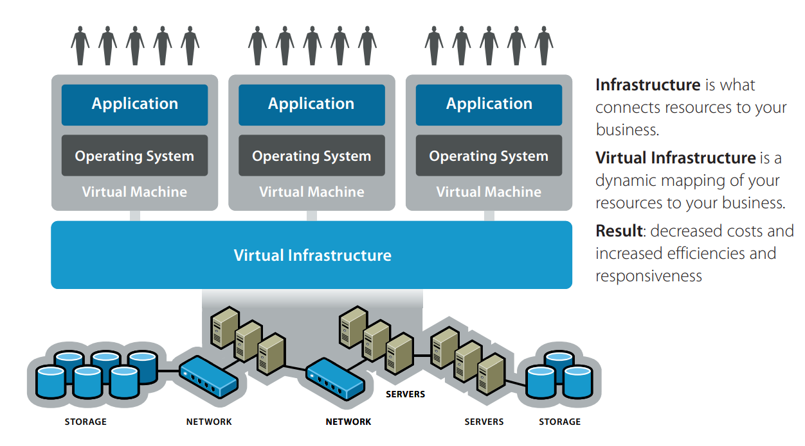
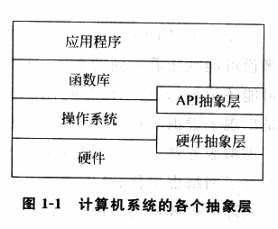
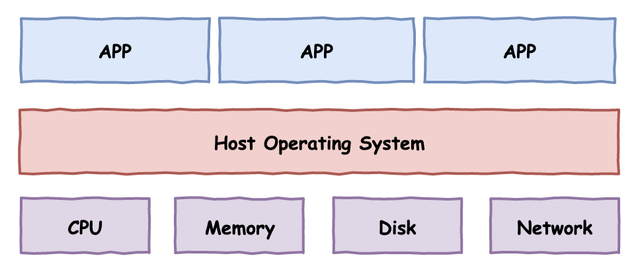
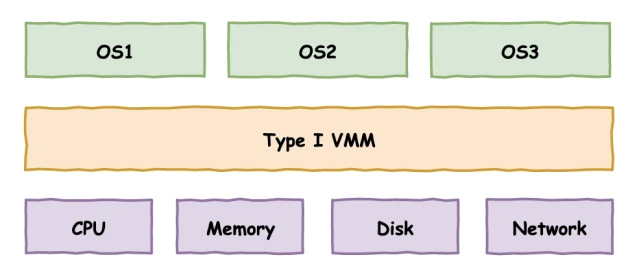

# 虛擬化技術簡介

什麼是虛擬化？狹義地說，大家在日常生活中說到的虛擬化主要指的還是 _虛擬機_ （Virtual Machine），即**通過虛擬化技術將一臺計算機虛擬爲多臺邏輯計算機**——這其實是虛擬化技術中的一個抽象粒度爲單個計算機的分支：`系統虛擬化`。

在計算機科學當中，**虛擬化**（Virtualization）指的其實是一種「**將計算機的各種實體資源進行邏輯抽象，從而呈現出不同的虛擬資源**」的資源管理技術。利用虛擬化技術，我們可以打破實體結構間不可切割的特性——一份實體資源可以對用戶呈現爲多份虛擬資源，多份實體資源也可以呈現爲一份物理資源。

通過虛擬化技術，我們可以實現資源的動態分配、靈活調度、跨域共享等，從而提高資源的利用率。

> 這裏所說的實體資源包括**CPU、內存、磁盤空間、網絡適配器**等。

這裏筆者摘抄一段來自一本經典的虛擬化技術教材的敘述：

> 抽象來說，虛擬化是資源的邏輯表示，它不受物理限制的約束。具體來說，虛擬化技術的實現形式是在系統中加入一個虛擬層，虛擬化層將下層的資源抽象成另一形式的資源，提供給上層使用。通過空間上的分割、時間上的分時以及模擬，虛擬化可以將一份資源抽象成多分。反過來，虛擬化也可以將多份資源抽象成一份。
>
> ——《系統虛擬化：原理與實現》

即虛擬化技術的實現其實源自於現代計算機系統自下而上的多層抽象的結構：「**每個層次都向上一層次呈現一個抽象，每一層只需要知道下層的抽象接口，而無需瞭解其內部運作機制**」——我們不難想到的是，**只要我們能夠通過某種方式向上層提供表現相同的抽象接口，在上層看來我們就是正常的該層所提供的資源，從而就實現了對該層的虛擬化。**

由此，從物理層與虛擬層的兩側來看，我們便有了虛擬化中的兩個重要定語：

- 「**Host**」：物理資源方。
- 「**Guest**」：虛擬資源方。

根據資源的不同，在這兩個定語之後我們可以接不同的名詞：例如我們將一臺物理機器稱之爲 `Host Machine` （宿主機），將運行在其上的虛擬機稱之爲 `Guest Machine` （客戶機）；相應地，在宿主機上若運行有操作系統，則稱之爲 `Host OS`，而運行在虛擬機中的操作系統稱之爲 `Guest OS`。

由此，我們將位於不同抽象層上的虛擬化分爲如下類：

- **硬件抽象層上的虛擬化**：通過虛擬硬件抽象層來實現虛擬機器，爲 Guest OS 呈現與物理硬件相同或相類似的硬件抽象層，也稱之爲「**系統級虛擬化**」（例如VMWare、Xen）。
- 操作系統層上的虛擬化：通常指的是操作系統內核可以提供多個互相隔離的用戶態實例（通常稱之爲容器），這些用戶態實例對其用戶而言就像是一臺真實的計算機，有着自己獨立的網絡、文件系統等（例如 VServer）。
- 庫函數層上的虛擬化：通過虛擬化操作系統的應用級庫函數的服務接口，使得應用程序不需要修改就可以在不同的操作系統中無縫運行（例如 Wine、WSL）。
- 編程語言層上的虛擬化：這類虛擬機運行的是進程級別的不存在於硬件上的虛擬體系結構，其程序代碼由虛擬機的運行時支持系統**翻譯**成機器語言後再執行，屬於進程級的虛擬化（例如 JVM）。

> 例如 Linux kernel 當中的 VFS 便是非常符合虛擬化這一概念的子系統：從上層調用的角度而言，我們所看到的都是統一的 API 接口，不同文件系統的具體實現則被隱藏在了 VFS 層的下方。我們只需要知道在這一抽象層中 open、read、write 等抽象 API 的用法，而無需關注底層的 ext4 或是 ntfs 的內部實現。
>
> 虛擬化亦是如此，從 Guest 側我們所能看到的也只是統一的虛擬資源的接口，或者說 Host 爲我們呈現出了虛擬化的資源接口，其表現的行爲與實體設備是一致的。

我們日常所說的虛擬化技術主要是**硬件抽象層上的虛擬化**，即「**系統級虛擬化**」：通過虛擬化技術將一臺計算機虛擬爲多臺邏輯計算機。

針對實體資源類型的不同，我們還可以再細分爲：

- **計算虛擬化**：針對 CPU 和內存資源進行虛擬化。
- **網絡虛擬化**：針對網絡鏈路資源進行虛擬化。
- **IO虛擬化**：針對 IO 資源進行虛擬化。
- **存儲虛擬化**：針對磁盤存儲資源虛擬化。

## 系統虛擬化概述

### 基本模型

我們首先給虛擬機下一個定義：

- **虛擬機**（Virtual Machine）是計算機的虛擬化實例，擁有自己的虛擬硬件（如 CPU、內存、設備等），可執行與計算機幾乎完全相同的功能，包括運行應用和操作系統。

對於一臺計算機，我們可以簡單地抽象成下圖所示的三層模型，從下往上分別是**物理硬件層、操作系統層、應用程序層**，因此我們可以把一個虛擬機實例看作是一臺具有如圖所示層次的**邏輯的計算機**：

但虛擬機的運行是需要有物理環境所支撐的，同時虛擬機實例也是不可能憑空出現/憑空消失的，因此接下來我們引入一個新的概念——**VMM**，即 `Virtual Machine Monitor`，又稱 `Hypervisor`，這是一個介於 VM 與硬件中間的軟件層，**其負責 VM 的創建、銷燬等工作，併爲 VM 提供了運行環境**：即 `虛擬硬件抽象層`。

1974年，Gerald J. Popek 與 Robert P. Goldberg 發表了合作論文[《Formal Requirements for Virtualizable Third Generation Architectures》](https://dl.acm.org/doi/pdf/10.1145/361011.361073)，在論文中提出了滿足虛擬化系統結構的 VMM 的三個充分條件，稱之爲`Popek and Goldberg virtualization requirements`：

- **等價性**（essentially identical）：一個運行於 VMM 下的程序，**其行爲應與直接運行於等價物理機上的同程序的行爲完全一致**
- **資源控制**（resource control）：VMM 對虛擬資源具有**完全的控制能力**，包括資源的分配、監控、回收
- **效率性**（efficiency）：機器指令中經常使用的那一部分應在沒有 VMM 干預下**直接在硬件上執行**

由此，論文中提出了兩種 Hypervisor 方案，這也成爲了現在最主流的兩種方案：

- `Type I` ：**Hypervisor 直接運行在硬件上，即以 Hypervisor 作爲 Host OS 直接管控硬件資源**。例如 `VMware ESXI` 便是採用此種架構的 Hypervisor

  

- `Type II`：**Hypervisor 運行在傳統的操作系統上，與其他應用程序並行運行**。例如 `Qemu` 與 `VMware Player` 便是採用此種架構的 Hypervisor

  

現在我們引入 `敏感指令` （sensitive instructions）的概念，該類指令即爲**操作特權資源的指令**，例如 IO 操作、修改頁表寄存器等。爲了我們的 VMM 能夠完全地控制系統資源，**敏感質量必須在 VMM 的監控審查下完成，或是經由 VMM 來完成**。因此，若一個架構中所有的特權指令都是敏感指令，則我們可以使用**特權級壓縮**（Ring Compression）的方式來實現虛擬環境：

- VMM 運行在最高特權級上，Guest VM 運行在低特權級上，當 Guest VM 執行到敏感指令時，其便會陷入位於最高特權級的 VMM，此時便能由 VMM 模擬敏感指令的行爲。

由此我們便獲得了系統虛擬化的經典模型——`Trap & Emulate`：

- 我們將操作系統分爲兩個運行模式：「用戶模式（user mode）」與「特權模式（privileged mode）」，在用戶模式下只能直接執行非特權指令，當執行到特權指令時便會觸發異常，從而陷入特權模式對應的處理代碼中。
- Guest VM 運行在用戶模式下，從而使得普通指令可以直接放在 CPU 上執行，當 Guest VM 執行到**敏感指令**時，便會**觸發異常，此時由 VMM 介入並模擬其應有的行爲**。

而由於硬件實體資源也有着不同的類型，我們將對不同類型實體資源的虛擬化技術分爲如下類型：

- CPU 虛擬化
- 內存虛擬化
- I/O 虛擬化

## REFERENCE

《系統虛擬化：原理與實現》——Intel 開源軟件技術中心

[【VIRT.0x02】系統虛擬化導論](https://arttnba3.cn/2022/08/29/VURTUALIZATION-0X02-BASIC_KNOWLEDGE/)

[Intel® 64 and IA-32 Architectures Software Developer's Manual Volume 3C: System Programming Guide, Part 3](https://cdrdv2.intel.com/v1/dl/getContent/671506)

[重學 Docker - part1: 虛擬化技術簡述](https://zhuanlan.zhihu.com/p/363922044)

[Formal Requirements for Virtualizable Third Generation Architectures](https://dl.acm.org/doi/pdf/10.1145/361011.361073)
